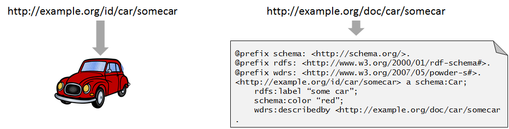

# Read-write Linked Data API
With regard to Linked Data API's three standards have emerged:

- [Linked data concept itself](http://www.w3.org/DesignIssues/LinkedData.html)
- [SPARQL Graph Update](http://www.w3.org/TR/sparql11-http-rdf-update)
- [Linked Data Platform](http://www.w3.org/TR/ldp)

The Linked data concept itself states "When someone looks up a URI, provide useful information, using the standards". This implies a RESTful API for GET http operations. The concept doesn't give directions how to update Linked Data resources (http operations like PUT, POST and DELETE).

The SPARQL Graph Update protocol is part of the SPARQL1.1 standaard. It gives directions what to do when to GET, POST, PUT, HEAD, PATCH or DELETE data to a named graph.

The Linked Data Platform gives directions what to do when to GET, POST, PUT, HEAD, PATCH, OPTIONS or DELETE data to a resource.

As stated in the specification of the Linked Data Platform, the two standards can be used together, but some precautions must be made. The two standards differ conceptually: a named graph versus a resource.

The Read-Write Linked Data API is a proposal to create an API specification that combines the three standards.

### RESTful web API's
Formally, an _API_ is an Application Programmers Interface (something that you program against), a _web API_ is an Application Programmers Interface that can be accessed using the http protocol and a _RESTful web API_ is an Application Programmers Interface that can be accessed using the http protocol and adhers to the [Representational State Transfer (REST) constraints](http://www.ics.uci.edu/~fielding/pubs/dissertation/rest_arch_style.htm), as defined by Roy Fielding. From this formal definition, the Read-Write Linked Data API is - for the most part - a RESTful web API.

However, in reality, the term "REST API" is often used for any request that can be made via http and returns some kind of json result. So in reality, the Read-Write Linked Data API is also a RESTful web API, because the API will return json-ld, which formally is a json format.

There's a catch however: despite the huge effort by the authors of the json-ld recommendation, most json-API users would prefer a more "closed model" version of the returned data, with nesting when applicable. They would like an [Open API Specification](https://www.openapis.org) which describes the way the returned data would look, which would probably *not* be json-ld, but plain json that conforms to a certain, API specific, scheme.

The Linked Data API should also support these kind of API's. A mapping between the fields defined in an Open API specification and the linked data should be provided to translate a json-ld document to the requested json document.   

## Linked Data concept
- `GET {URI}` returns useful information about a resource that is described by the information-resource identified by {URI}.
- `GET {URI}#{fragment}` returns useful information contained in the information-resource identified by {URI}. At least information about the resource identified by {URI}#{fragment} should be present.
- `GET {URI}` returns a 303 to the information resource that describes a non-information resource identified by {URI}.

The Linked Data concept doesn't really give directions how to access a resource that cannot be dereferenced (such as URN's). A best practice for these situations might be:

- `GET /resource?subject={URI}` returns useful information about a resource identified by {URI}.

A best practice with regard to "userful information about a resource" is the [Concise Bounded Description (CBD)](http://www.w3.org/Submission/CBD) of a resource.

A key concept is the distinction between a non-information resource and an information-resource (see: [the architecture of the world-wide-web, section 2.2](http://www.w3.org/TR/webarch#id-resources)). Non-information resources (real-life things or abstract concepts) cannot be returned via the http protocol. Non-information resources are associated with one or more information resources that describe the non-information resource.

The car on the left cannot be returned via the http protocol: it's not information, it's a real-life thing. According to the Linked Data concept, it is a non-information resource, and can be identified by a URI. The turtle document on the right can be returned via the http protocol: it's an information-resource. This particular information resource is a description of the real-life car on the left.

## SPARQL Graph Update
- `GET {URI}` returns the set of triples contained in a named graph identified by {URI}.
- `GET /{access-point}?graph={URI}` returns the set of triples contained in a named graph identified by {URI}. The access-point can be any URL.
- `PUT {URI}` replaces the content of a named graph identified by {URI}.
- `PUT /{access-point}?graph={URI}` replaces the content of a named graph identified by {URI}.
- `POST {URI}` merges the content of a named graph identified by {URI}.
- `POST /{access-point}?graph={URI}` merges the content of a named graph identified by {URI}.
- `DELETE {URI}` deletes the content of a named graph identified by {URI}.
- `DELETE /{access-point}?graph={URI}` deletes the content of a named graph identified by {URI}.

## Linked Data Platform

#### Plain resources

- `GET {URI}` returns the content of an information resource identified by {URI}.
- `PUT {URI}` replaces the content of an information resource identified by {URI}.
- `POST {URI}` merges the content of an information resource identified by {URI}.
- `DELETE {URI}` deletes the content of an information resource identified by {URI}.

#### Container resources

- `GET {URI}` returns the content of a container information resource.
- `POST {URI}` adds a new information resource (a member) to a container information resource, and returns the newly minted URI of this information resource member.

The Linked Data Platform defines three different types of containers. Some extra triples might be created, dependent on the type of container:

- Basis container: no extra triples are created;
- Direct container: an extra membership triple is created between the subject of the container (might be a non-information resource) and the newly created container;
- Indirect container: an extra membership triple is created between the subject of the container (might be a non-information resource) and a member related resource (might be a non-information resource, different from the original member URI).

## Proposal for the read-write API

### Catagories of resources

For this proposal, we would like to make the distinction between some different categories of resources:

1. Non-information resources.
2. Information resources
  1. Basic information resources
     1. Single subject information resources
     2. Multiple subject information resources
  2. Container information resources
  3. Collection information resources
3. Non-REST resources
  1. Query resources
  2. Production resources

The proposal focusses on GET, POST, PUT and DELETE operations and should be compliant to the three standards mentioned at the beginning of this document.

### Extra functionality

Some extra functionality is proposed, on top of the standards. It should be possible not to use this extra functionality:

1. Assertions: validations should be possible agains PUT, POST and DELETE operations. If an assertion fails, a 409 Conflict http error should be returned;
2. Post-operations: it should be possible to perform some SPARQL update queries after the data is added.
3. Translations: not only RDF serializations should be possible to PUT or POST, but also other known formats. A specific translator per format should exist to translate the data to RDF.
4. Versioning and metadata: it should be possible that data is inserted according to a know versioning-pattern.

### 1. Non-information resources
Non-information resources should be identified using a `id`-URI or a `#`-URI.

The use of `id`-URI's requires the existance of a URI-minting-strategy with a concise decision to reserve particular URI's as references to non-information resources. A best-practice is the following URI-minting template:

	http://{full-qualified-domain-name}/{path}/id/{collection}/{reference}

A `#`-URI is any URI with a fragment path, like:

	http://{full-qualified-domain-name}/{path}#{fragment}

- `GET` to a `id`-URI results in a 303 See Other to the corresponding information resource that describes this information resource.
- `GET` to a `#`-URI results in the retrieval (200 OK) of the corresponding information resource, identified by the URI without `#{fragment}`. 
- `POST`, `PUT` and `DELETE` result in 405 Method not allowed error.

### 2.1 Basis information resources
Basis information resources should be [Linked Data Platform Resources](http://www.w3.org/TR/ldp/#ldpr), and as such operate als RESTful API's.

Two categories of basis information resources are proposed:

1. Information resources that describe a single (non-)information resource
2. Information resources that describe multiple (non-)information resources.

The first category corresponds with a `doc`-URI that is the description of a `id`-URI. The second category correponds with a `#`-URI that is the description of all the resources that only differ in the fragment-part.

#### 2.1.1 Single subject information resources

- `GET` to a `doc`-URI results in the set of triples that are identified by this URI. This should be the CBD of the corresponding `id`-URI and the CBD of the `doc`-URI. Informatively: *the data and the metadata*.
- `PUT` to a `doc`-URI results in the replacement of the set of triples that are identified by this URI.
- `POST` to a `doc`-URI results in the merging of the set of triples that are identified by this URI.
- `DELETE` to a `doc`-URI results in the removal of the set of triples that are identified by this URI. 

#### 2.1.2 Multiple subject information resources

- `GET` to a `#`-URI results in the set of triples that are identified by the URI without the fragment part. This should be all the triples in the named graph that is identified by the same URI (without the fragment).
- `PUT` to a `#`-URI results in the replacement of the set of triples that are identified by the URI without the fragment part.
- `POST` to a `#`-URI results in the merging of the set of triples that are identified by the URI without the fragment part.
- `DELETE` to a `#`-URI results in the removal of the set of triples that are identified by the URI without the fragment part.

### 2.2 Container information resources

Remark: the term "container" is not the same as the term "LDP-container". Container-URI's are REST API's that comply to the SPARQL Graph Update protocol. LDP-containers are support, but are called "collections", as described in section 2.3.

- `GET` to a container-URI results in the set of triples that are identified by this URI. This should be all the triples in the named graph that is identified by the same URI.
- `PUT` to a container-URI results in the replacement of the set of triples that are identified by this URI.
- `POST` to a container-URI results in the merging of the set of triples that are identified by this URI .
- `DELETE` to a container-URI results in the removal of the set of triples that are identified by this URI.

### 2.3 Collection information resources

Collections resemble LDP-containers. From a collection, it is possible to create new resources. Typical collections have URI's that conform to the following pattern:

	http://{full-qualified-domain-name}/{path}/doc/{collection}

- `GET` to a collection-URI results in a paged list (200 Ok) of all resources in the collection. A filter can be added, which will give not only a list of resources, but also the CBD of the resources themselves.
- `PUT` to a collection-URI should replace the collection itself, and all its members. (This might not be an ideal operation...)
- `POST` to a collection-URI should create a new resource, based on the data in the body. The `POST` operation on a collection resembles the `PUT` operation on a single subject information resource, but will mint a URI's for the information resource and the non-information resources (`doc` versus `id` URI's). An 201 Created response code should be given, with the newly minted URI in the "location" field.
- `DELETE` to a collection-URi should delete the whole collection.

## 3 Non-REST resources
Non-REST resources are resources that are not RESTful, but might return complex information products or some complex update on the triplestore.

### 3.1 Query resources

Query resources only respond to `GET` requests. A query resource resembles a particular SPARQL query that doesn't return a typical CBD, but might contain triples from multiple named graphs, or even a sparql-result-set.

- `GET` to a query resource results in a set of triples or a sparql result set. A 200 Ok response is given when the correct mime-type can be returned. A 406 reponse is given when the accept request header doesn't fit the typical response (sparql results sets cannot be converted to a turtle response and visa versa).
- `POST`, `PUT` and `DELETE` result in 405 Method not allowed error.

###3.2. Production resources

Production resources are like container resources, but without the intention to upload data. Only changes to the triplestore are performed. Production resources resemble one or more SPARQL Update queries.

- `GET` to a production resource will return a 200 Ok response with meta-information about the production resource, and a link how to perform the actual production (a `POST`-call).
- `POST` to a production resource will execute the production. A 200 Ok response is given when the execution has been succesful. The response body will contain information about the execution. In case of an error, a 409 Conflict response is given. 
- `PUT` and `DELETE` result in 405 Method not allowed error.
